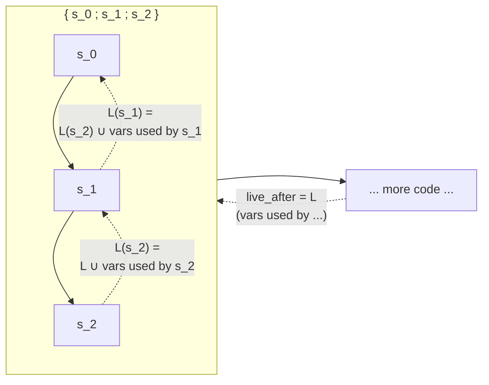

# Giving

In the [previous chapter](./a-simple-function.md),
we walked through a program that created a value and ignored it.
Now we'll see what happens when you actually *use* a value --
and how the type checker decides whether that's allowed.

## Place expressions

In Dada, values are accessed through **place expressions** like `d.give`.
A place expression combines a **place** (a variable, possibly with field projections)
and an **access mode** (what you want to do with the value):

{anchor}`PlaceExpr`

A place is a variable with zero or more field projections:

{anchor}`Place`

A projection is a field access:

{anchor}`Projection`

The access mode determines what kind of access is being performed:

{anchor}`Access`

| Access | Meaning |
| --- | --- |
| `give` | Give ownership of the value (move) |
| `ref` | Borrow a shared reference |
| `mut` | Borrow a mutable reference |
| `share` | Create a shared copy |

We'll start with `give`, which is the most fundamental.

## Giving a value

If you are familiar with Rust,
`give` is analogous to a move.
When you give a value, you transfer ownership of it.
The following program creates a `Data` value and gives it away as the return value:

```rust
# extern crate dada_model;
dada_model::assert_ok!(
    {
        class Data { }

        class Main {
            fn test(given self) -> Data {
                let d = new Data();
                d.give;
            }
        }
    }
);
```

### The `give place` rule

A place expression like `d.give` is typed by this rule:

{judgment-rule}`type_expr, give place`

Walking through the premises:

- **`access_permitted(env, &live_after, Access::Gv, &place)`** --
  Check that giving this place is permitted.
  This verifies that no other live variable holds a conflicting
  borrow or lien on the place. (In this simple example, nothing does.)

- **`env.place_ty(&place)`** --
  Look up the type of `d` in the environment: `Data`.

- **`move_place(&env, &live_after, &place, &ty)`** --
  Decide whether to move or copy the value.
  This is where liveness matters.

## Liveness

In the previous chapter, we mentioned that every judgment rule
carries a `live_after` parameter -- the set of places
that are used later in the program.
Nothing interesting happened with liveness there
because we never used our variables again.
Now it becomes central.

### How liveness is computed

Recall the `type_statements_with_final_ty` rule
that walks through a block's statements.
Its first premise is `live_after.before(&statements)`,
which computes what's live before the current statement
by scanning forward through the remaining statements:



`live_after` captures what the code *after* the block needs.
But a block isn't atomic -- it has internal structure.
So when processing `s_0`, the type checker extends `live_after`
by scanning forward through the remaining statements `[s_1, s_2]`
and collecting every place they reference.
This tells each judgment which places are still needed
and which are free to be moved.

### The `move_place` judgment

The `move_place` judgment uses liveness to decide
whether an access moves or copies a value:

{judgment}`move_place`

It has two rules. Which one fires depends on whether the place is live.

The **"give"** rule applies when the place is *not* live afterward.
It marks the place as moved (in-flight):

{judgment-rule}`move_place, give`

The **"copy"** rule applies when the place *is* still live.
In that case, the value must be copyable (like `Int` or a `struct` type),
or the type check fails:

{judgment-rule}`move_place, copy`

### Applying it to `d.give`

In our example:

```text
let d = new Data();
d.give;
```

When we process `d.give`,
`live_after` is `{}` -- nothing comes after the method returns.
So `d` is not live, the "give" rule fires, and `d` is moved.

## Giving a value twice is an error

Once a value has been given away, it is gone.
Trying to use it again is an error:

```rust
# extern crate dada_model;
dada_model::assert_err_str!(
    {
        class Data { }

        class Main {
            fn test(given self) -> Data {
                let d = new Data();
                d.give;
                d.give;
            }
        }
    },
    r#"the rule "give" at (*) failed"#,
    "`!live_after.is_live(&place)`",
    "&place = d",
);
```

This time, when we process the *first* `d.give`,
the remaining statement is the second `d.give`, which references `d`.
So `d` *is* live, and the "copy" rule fires instead.
But `Data` is a class (not a struct), so it doesn't satisfy `prove_is_copy` --
the type check fails.

This is the same principle as Rust's move semantics --
after a move, the original binding is no longer valid.

## Giving a field

You can give individual fields from a class instance.
After giving a field, that specific field is no longer available,
but other fields remain accessible:

```rust
# extern crate dada_model;
dada_model::assert_ok!(
    {
        class Data { }

        class Pair {
            a: Data;
            b: Data;
        }

        class Main {
            fn test(given self) -> Data {
                let p = new Pair(new Data(), new Data());
                p.a.give;
                p.b.give;
            }
        }
    }
);
```

When processing `p.a.give`, the live set includes `p.b`
(because the next statement references it),
but `p.a` is not live -- nothing after this point uses `p.a`.
So the "give" rule fires for `p.a`.

Then when processing `p.b.give`, nothing is live afterward,
so the "give" rule fires again for `p.b`.

## Giving a field and then the whole value is an error

If you give away a field, the whole value is now incomplete,
so you can't give the whole thing:

```rust
# extern crate dada_model;
dada_model::assert_err_str!(
    {
        class Data { }

        class Pair {
            a: Data;
            b: Data;
        }

        class Main {
            fn test(given self) -> Pair {
                let p = new Pair(new Data(), new Data());
                p.a.give; // <-- Error! Can't give `p.a` when `p` will be used later.
                p.give;
            }
        }
    },
    r#"the rule "give" at (*) failed"#,
    "`!live_after.is_live(&place)`",
    "&place = p . a",
);
```

When processing `p.a.give`, the next statement is `p.give`,
which references `p`. Since `p.a` overlaps with `p`,
the liveness check `is_live(p.a)` returns true --
`p.a` is live because `p` (which includes `p.a`) will be used.
The "copy" rule fires, `Data` isn't copyable, and the check fails.

Conversely, if you give the whole value, you can't access its fields afterward:

```rust
# extern crate dada_model;
dada_model::assert_err_str!(
    {
        class Data { }

        class Pair {
            a: Data;
            b: Data;
        }

        class Main {
            fn test(given self) -> Data {
                let p = new Pair(new Data(), new Data());
                p.give;   // <-- Error! Can't give `p` when `p.a` will be used later.
                p.a.give;
            }
        }
    },
    r#"the rule "give" at (*) failed"#,
    "`!live_after.is_live(&place)`",
    "&place = p",
);
```

Here, when processing `p.give`, the next statement references `p.a`.
Since `p` is a prefix of `p.a`, `is_live(p)` returns true.
Same result: the "copy" rule fires, `Pair` isn't copyable, failure.

## Structs are copyable

Unlike class instances, struct values are always shared and can be given multiple times.
`Int` is a built-in struct, so this works fine:

```rust
# extern crate dada_model;
dada_model::assert_ok!(
    {
        class Main {
            fn test(given self) -> Int {
                let x = 22;
                x.give;
                x.give;
            }
        }
    }
);
```

When processing the first `x.give`, the second `x.give` references `x`,
so `x` is live. The "copy" rule fires -- but this time `Int` is a struct type,
so `prove_is_copy` succeeds, and the value is copied rather than moved.
